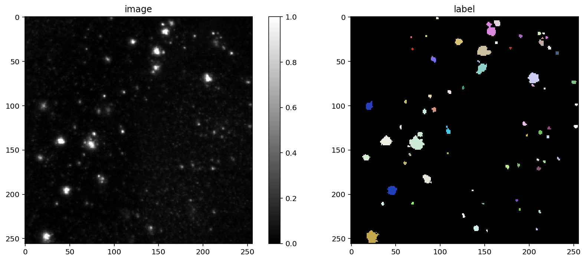
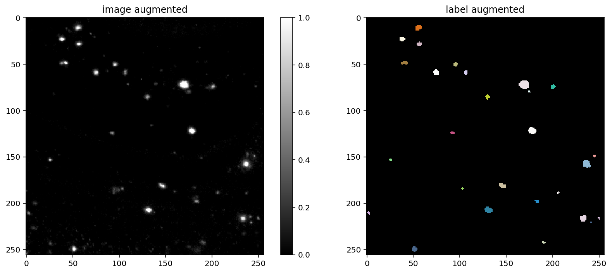
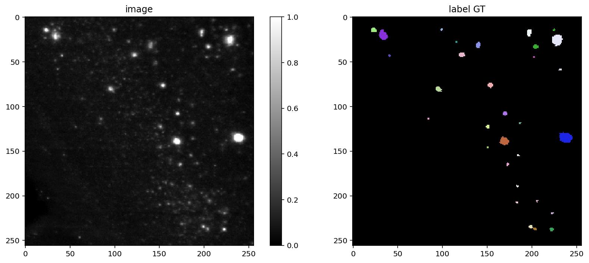

# 3D Segmentation of Cleared Mouse Brains and Plaque.

#### Contributors: 
Veronika Valova:   <br>
Richard Harwood: https://github.com/RichardHarwood <br>

## Introduction
The bioimage analysis goal here was to segment the plaque from cleared mouse brains across different ages and investigate the influence of saffron on plaque density.
The biggest hurdle was segmenting the plaque the issue is that plaque only spanned a few pixels and there was noise that looked similar to plaque (a few white pixels clumped together). That being said it was not difficult to identify the plaques with the human eye. 

We tried a "recipe" of thresholding, remove objects, watershed but this did not perform great. We then tried cellpose - this was promising. We then decided that any generalist machine learning workflow would beneift from trained data so we segmented 5 slices to start with. We didnt see massive gains with cellpose but when we tried with Stardist we got really good segmentation. 

Here, we provide a drop down which documents the Python code. Upon publication all images will be publicly avalaible:
We note that we had to do very little beyond the example on the Stardist github, so we thank the authors of Stardist immensily. 

#### Python workflow to train star dist and segment unseen data (note that Juypter notebooks are also stored in this project)

<details>
<summary> View Python Workflow that uses Machine Learning to Segment Plaque in 3D </summary>
<br>

**Import packages** 
```python 
from __future__ import print_function, unicode_literals, absolute_import, division
import sys
import numpy as np
import matplotlib
matplotlib.rcParams["image.interpolation"] = None
import matplotlib.pyplot as plt
%matplotlib inline
%config InlineBackend.figure_format = 'retina'

from glob import glob
from tifffile import imread
from csbdeep.utils import Path, normalize
from csbdeep.io import save_tiff_imagej_compatible

from stardist import random_label_cmap, _draw_polygons, export_imagej_rois
from stardist.models import StarDist2D
from stardist.models import StarDist3D
import tifffile 
from skimage import img_as_uint
from skimage import (exposure, feature, filters, io, measure,
                      morphology, restoration, segmentation, transform,
                      util)
from tqdm import tqdm
from stardist import fill_label_holes, random_label_cmap, calculate_extents, gputools_available
from stardist.matching import matching, matching_dataset
from stardist.models import Config2D, StarDist2D, StarDistData2D

np.random.seed(6)
lbl_cmap = random_label_cmap()
```
**Define directories that contain images and masks and run some checks and normalistaions
*Note that the images are as a stack and the raw inage is 8 bit gray scale and the masks each plaque is a unique object)*

```python
X = sorted(glob('E:/StarDist/images/*.tif'))
Y = sorted(glob('E:/StarDist/masks/*.tif'))
assert all(Path(x).name==Path(y).name for x,y in zip(X,Y))

X = list(map(tifffile.imread,X))
Y = list(map(tifffile.imread,Y))
n_channel = 1 if X[0].ndim == 2 else X[0].shape[-1]

axis_norm = (0,1)   # normalize channels independently
# axis_norm = (0,1,2) # normalize channels jointly
if n_channel > 1:
    print("Normalizing image channels %s." % ('jointly' if axis_norm is None or 2 in axis_norm else 'independently'))
    sys.stdout.flush()

X = [normalize(x,1,99.8,axis=axis_norm) for x in tqdm(X)]
Y = [fill_label_holes(y) for y in tqdm(Y)]
```
**Split into training and testing data**

```python 
assert len(X) > 1, "not enough training data"
rng = np.random.RandomState(42)
ind = rng.permutation(len(X))
n_val = max(1, int(round(0.15 * len(ind))))
ind_train, ind_val = ind[:-n_val], ind[-n_val:]
X_val, Y_val = [X[i] for i in ind_val]  , [Y[i] for i in ind_val]
X_trn, Y_trn = [X[i] for i in ind_train], [Y[i] for i in ind_train] 
print('number of images: %3d' % len(X))
print('- training:       %3d' % len(X_trn))
print('- validation:     %3d' % len(X_val))
```
**Define a plot function**

```python
def plot_img_label(img, lbl, img_title="image", lbl_title="label", **kwargs):
    fig, (ai,al) = plt.subplots(1,2, figsize=(12,5), gridspec_kw=dict(width_ratios=(1.25,1)))
    im = ai.imshow(img, cmap='gray', clim=(0,1))
    ai.set_title(img_title)    
    fig.colorbar(im, ax=ai)
    al.imshow(lbl, cmap=lbl_cmap)
    al.set_title(lbl_title)
    plt.tight_layout()
   ```
**Plot the original image (left) and the hand segmented label (right)**

```python
i = min(9, len(X)-1)
img, lbl = X[i], Y[i]
assert img.ndim in (2,3)
img = img if (img.ndim==2 or img.shape[-1]==3) else img[...,0]
plot_img_label(img,lbl)
None;
```



**Begin model setup: currently just using stardist suggestions**

```python
# 32 is a good default choice (see 1_data.ipynb)
n_rays = 32

# Use OpenCL-based computations for data generator during training (requires 'gputools')
use_gpu = False and gputools_available()

# Predict on subsampled grid for increased efficiency and larger field of view
grid = (2,2)

conf = Config2D (
    n_rays       = n_rays,
    grid         = grid,
    use_gpu      = use_gpu,
    n_channel_in = n_channel,
)
print(conf)
vars(conf)
  
```
**Check if GPU is avaliable and limit usage**

```python 
if use_gpu:
    from csbdeep.utils.tf import limit_gpu_memory
    # adjust as necessary: limit GPU memory to be used by TensorFlow to leave some to OpenCL-based computations
    limit_gpu_memory(0.8)
    # alternatively, try this:
    # limit_gpu_memory(None, allow_growth=True)
```

**Choose which model is the base**

```python 
model = StarDist2D(conf, name='stardist', basedir='models')
```

**Choose median object size**

```python 
median_size = calculate_extents(list(Y), np.median)
fov = np.array(model._axes_tile_overlap('YX'))
print(f"median object size:      {median_size}")
print(f"network field of view :  {fov}")
if any(median_size > fov):
    print("WARNING: median object size larger than field of view of the neural network.")
```   
**Set up data augmentgation**
  
```python
def random_fliprot(img, mask): 
    assert img.ndim >= mask.ndim
    axes = tuple(range(mask.ndim))
    perm = tuple(np.random.permutation(axes))
    img = img.transpose(perm + tuple(range(mask.ndim, img.ndim))) 
    mask = mask.transpose(perm) 
    for ax in axes: 
        if np.random.rand() > 0.5:
            img = np.flip(img, axis=ax)
            mask = np.flip(mask, axis=ax)
    return img, mask 

def random_intensity_change(img):
    img = img*np.random.uniform(0.6,2) + np.random.uniform(-0.2,0.2)
    return img


def augmenter(x, y):
    x, y = random_fliprot(x, y)
    x = random_intensity_change(x)
    # add some gaussian noise
    sig = 0.02*np.random.uniform(0,1)
    x = x + sig*np.random.normal(0,1,x.shape)
    return x, y
  
```
  
  **Plot examples of augmented data**
    
```python 
    # plot some augmented examples
img, lbl = X[0],Y[0]
plot_img_label(img, lbl)
for _ in range(3):
    img_aug, lbl_aug = augmenter(img,lbl)
    plot_img_label(img_aug, lbl_aug, img_title="image augmented", lbl_title="label augmented")
  
```  
   
  
**Retrain stardist with hand segmented images**  
  
```python
    quick_demo = False

if quick_demo:
    print (
        "NOTE: This is only for a quick demonstration!\n"
        "      Please set the variable 'quick_demo = False' for proper (long) training.",
        file=sys.stderr, flush=True
    )
    model.train(X_trn, Y_trn, validation_data=(X_val,Y_val), augmenter=augmenter,
                epochs=2, steps_per_epoch=10)

    print("====> Stopping training and loading previously trained demo model from disk.", file=sys.stderr, flush=True)
    model = StarDist2D.from_pretrained('2D_demo')
else:
    model.train(X_trn, Y_trn, validation_data=(X_val,Y_val), augmenter=augmenter,  epochs=400)
None;
```    
  
**Investigate on some training data**  
  
   ```python 
   Y_val_pred = [model.predict_instances(x, n_tiles=model._guess_n_tiles(x), show_tile_progress=False)[0]
              for x in tqdm(X_val)]
   plot_img_label(X_val[0],Y_val[0], lbl_title="label GT")
   plot_img_label(X_val[0],Y_val_pred[0], lbl_title="label Pred")  
  
   ```  
  
  
  
   


   ### Use this model on a whole cleared mousebrain 
   
   **Load in an imgage (here we use 6 month old)**
   
```python 
   X=tifffile.imread('E:\\VV_STEP1\\6_Month_50perc_Reduced_1080x1280.tif')
   patches=X
```
   **Run star dist on every slice using a for loop**
  
  ```python 
  predicted_patches = []

for i in range(patches.shape[0]):
        single_patch = patches[i]
        img = normalize(single_patch, 1,99.8, axis=axis_norm)
        labels, details = model.predict_instances(img)
        predicted_patches.append(labels)
  
  predicted_patches = np.array(predicted_patches)
  star_dist_binary= (predicted_patches>1).astype(int)
  ```
  
  **Export the segmentation**
  ```python 
  io.imsave('E:\\VV_STEP1\\STARDIST_BINARY_OUT_6_Month_50perc_Reduced_1080x1280.tiff', img_as_uint(star_dist_binary))
  ```
 
  </details>
  
  Segmentations of the hippocampus and cerebal cortex were done manually in Avizo, during this process any star dist segmentations of plaque that fell with in either part of the brain were assinged to that area.
  <br>
  This creates 4 unique objects:<br>
   * A segmentation of the hippocampus
   * A segmentation of plaque in the hippocampus 
   * A segmentation of the cerebal cortex
   * A segmentation of plaque in the cerebal cortex 

Each of these objects is exported as a TIFF stack.

From here it really doesnt matter where you get the anatomical information from or make images and videos. <br>
I do find that a script is really helpful - because you can get initial movies, data and images quickly (and you can also create a batch process).<br>
Here is the output from Visualise an Analyse The 6 Month Mouse Brain.ipynb. <br>


  
